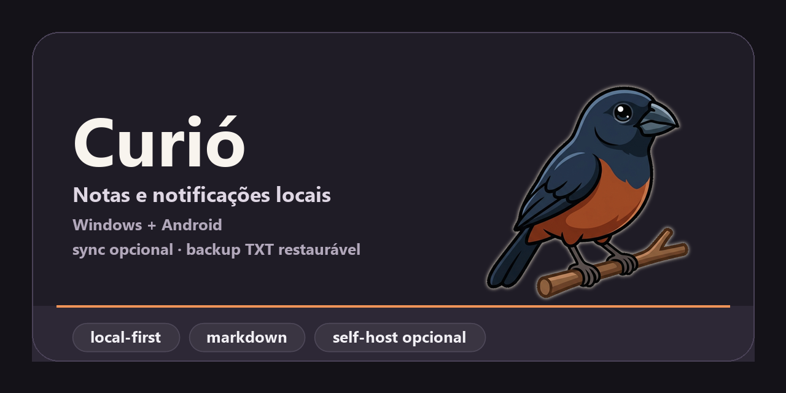

  

<h1 align="center">Curió</h1>

  <strong>Suas notas, tarefas e lembretes — locais, rápidos e seus.</strong> 
  Para Windows e Android · Sem conta · Sem nuvem obrigatória · Sem anúncios

---

O **Curió** é um aplicativo de notas diárias, agenda e lembretes construído
sobre uma regra inegociável: **os seus dados ficam com você**. Tudo é gravado
no seu aparelho, em um banco SQLite local e em backups de texto que qualquer
editor abre. Não existe cadastro, não existe servidor da empresa — porque não
existe empresa. Existe um app, o seu computador e o seu celular.

O nome vem do curió, pássaro brasileiro conhecido pelo canto — que é,
literalmente, o som do alarme padrão do app.

## O que ele faz

- **Notas diárias e gerais** com editor Markdown completo: barra de
  formatação, atalhos de teclado e visualização lado a lado.
- **Agenda e Quadro mensais** para navegar pelos dias que têm conteúdo.
- **Tarefas** com filtros, data/hora opcional e criação direta a partir de uma
  nota.
- **Lembretes que tocam de verdade**: notificações locais confiáveis no
  Windows (toasts) e no Android (alarme exato, sobrevive a reboot), com som de
  canto de curió e modo soneca.
- **Autosave contínuo** com histórico das últimas 50 versões de cada nota.
- **Busca global** em notas e notificações.
- **Backup em `.txt` legível por humanos** — com verificação de integridade e
  restauração completa. Seus dados nunca ficam reféns de um formato fechado.
- **Importação e exportação de calendários `.ics`** (Outlook, Google
  Calendar).
- **Zoom de 20% a 200%**, três temas (Aurora, Slate e Lumen) e modo
  claro/escuro automático.

## Privacidade e sincronização

O Curió é **local-first**: funciona 100% offline, para sempre. A sincronização
entre aparelhos é **opcional e self-hosted** — você roda o servidor (Docker ou
um executável) na sua própria máquina ou rede, com HTTPS e *certificate
pinning* configurados por um código de pareamento que você cola uma única vez.
O servidor apenas replica dados criptografados em trânsito entre os seus
aparelhos; notificações são sempre agendadas localmente em cada um. Nenhum
dado seu passa por infraestrutura de terceiros.

## Downloads

Os instaladores ficam em [**Releases**](https://github.com/homi-lindo/curio/releases):

| Plataforma | Artefato |
|---|---|
| Windows (portátil, sem instalação) | `curio-windows-test.exe` |
| Windows (instalador) | `curio-windows-installer.msix` |
| Android | `curio-android-test.apk` |
| Servidor de sync (opcional) | `curio-self-host.zip` |

O projeto está em fase de teste; feedback é muito bem-vindo nas
[Issues](https://github.com/homi-lindo/curio/issues).

## Open source

O Curió é **software livre e de código aberto**, sob a [licença MIT](LICENSE).
Você pode ler, auditar, compilar e modificar cada linha — inclusive a do
servidor de sincronização, para ter certeza do que roda na sua rede.
Contribuições são bem-vindas via Issues e Pull Requests.

Para compilar, arquitetura e detalhes técnicos, comece pelo
[guia de desenvolvimento](docs/desenvolvimento.md). A política de privacidade
está em [docs/privacy-policy.md](docs/privacy-policy.md).

## Apoie o projeto

O Curió é gratuito, sem anúncios e sem planos pagos. Se ele te ajuda no dia a
dia e você quiser apoiar o desenvolvimento, pode fazer uma doação de qualquer
valor via Pix:

  <a href="https://livepix.gg/curioapp"><strong>💚 Doar via LivePix → livepix.gg/curioapp</strong></a>

